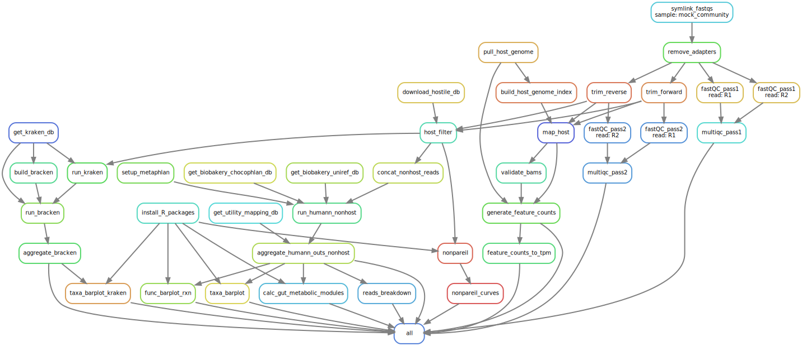

# HoMi
HoMi is your friend for <ins>Ho</ins>st-<ins>Mi</ins>crobiome dual transcriptome data processing. 


## What is HoMi?
HoMi is a pipeline developed to streamline processing host-microbiome dual transcriptome data, but it can also work with solely metagenomic or metatranscriptomic data for host filtering and mapping-based processing to taxonomic and functional profiles.

HoMi manages software environments and deployment on a Slurm-managed compute cluster, but it can also be run locally. For statistics tools, see the R package [HoMiStats](https://github.com/sterrettJD/HoMiStats).

HoMi is currently under development! Please feel free to raise an issue or contribute.

## Installation
```
conda create -n HoMi python=3.11
conda activate HoMi
pip install homi-pipeline
```

## Usage
```
HoMi.py <config_file> --cores <n_cores> --profile <profile_name>
```

### Config file
An example config file is provided in `tests/example_config.yaml`. This config file should contain paths to relevant files, like the metadata and databases. It can also be used to alter rule-specific resource requirements (details in example config).

Do you want to make sure your config file fits the requirements? Run `check_config.py <config_filepath>` to find out! (See `src/check_config.py`). HoMi will also automatically check your config before running the pipeline.

### Metadata file
An example metadata file is provided in `tests/example_metadata.csv`.
Metadata files should contain (at the minimum) a Sample column (named `Sample`), a forward reads filepath column (column name specified in the config file under `fwd_reads_path`), and a reverse reads filepath column (column name specified in the config file under `rev_reads_path`). These filepaths should be relative to the directory from which you are running `HoMi`.

### Using HoMi on a cluster
If running HoMi on a cluster with SLURM, please setup a [Snakemake SLURM profile](https://github.com/Snakemake-Profiles/slurm). This will handle submitting batch jobs for each sample for each step of the pipeline. Then, pass this the name of this profile to `HoMi.py <config_file> --profile <profile_name>`, no cores need to be passed.

`src/profile_setup.py` is a script that can be used to setup a cluster profile for Slurm integration, with options for clusters with and without hyperthreaded cores.

### Conda environment building
If conda environments have already been built, and you'd like snakemake to not build them, pass the argument `--conda_prebuilt`. This is particularly useful if running HoMi on a system with ARM architecture, like a Mac with M1/M2 chip. 

### Working directory
The working directory for HoMi can be set using the `--workdir` flag. This will set the "home base" for any relative filepaths within HoMi or your config, but it will not affect the filepath of the config or profile provided to HoMi.

### Running with example dataset
```
# Create the mock community (too big for github)
python benchmarking/synthetic/create_mock_community.py tests/mock_community_sim_params.csv --work_dir tests/mock_community/

# Use the example config and example metadata provided
HoMi.py tests/example_config.yaml --cores 1
```

### Unlocking a snakemake directory
Sometimes, when snakemake unexpectedly exits (e.g., due to a server connection timeout), the directory may be locked. Pass the argument `--unlock` to unlock the directory before running `HoMi.py`.

## Pipeline steps
### Preprocessing
1. Create a symbolic link to the sequencing files.
2. Trim reads using Trimmomatic
    - Trims adapter sequences from reads
    - Trims reads with a starting PHRED quality below `readstart_qual_min`
    - Trims reads with an ending PHRED quality below `readend_qual_min`
    - Trims reads with wherever there's a 4-base sliding window average PHRED quality score below 20
    - Removes reads with a length below `min_readlen`
3. Generates quality report with FastQC + MultiQC
4. Trim read ends using Seqtk
    - Consider this a second pass, in case Trimmomatic didn't catch something
5. Generates a second pass quality report with FastQC + MultiQC after the second trimming step

### Read mapping
6. Remove host reads using Hostile
    - User should pass a database in the config file. Currently supported options are `human-t2t-hla` and `human-t2t-hla-argos985`.
    - OR users can pass a filepath to a bowtie2 index without the `.bt` extensions (e.g., `index/example_index`, where files exist named `index/example_index.bt1`, `index/example_index.bt2`, etc.).
7. Microbial read profiling
    - (A) Run HUMAnN pipeline on nonhost reads to profile microbial reads
        - Makes microshades taxa barplot from MetaPhlan and HUMAnN outputs
    - (B) Run Kraken + Bracken on nonhost reads to profile microbial taxa 
        - Second taxonomy method for redundancy/validation/comparison

8. Align all reads against the host genome
    - HoMi will by default download the GRCh38 human reference genome, but you can provide an alternative genome (fna + gtf) if it's already downloaded
    - Either BBmap or HISAT2 is used to map the reads (HISAT2 by default), and featureCounts is used to generate a read count table

### DAG



## Using this pipeline for microbe-only samples 
To use this pipeline for metagenomics/metatranscriptomics, you can add an (optional) column in the metadata, titled `map_host`. If `map_host` doesn't exist in your metadata, the entire pipeline (including mapping to the host genome) will be performed for all samples. If `map_host` exists, it should only contain boolean values (True/False), and the host genome will only be mapped for samples where `map_host` is True. This will still run host decontamination before microbial taxonomic/functional profiling.

Example:
```
Sample,map_host 
sample_nohost,False 
sample_withhost,True
```

## Main repository contents
- `snakefile` contains the bulk of the pipeline
- `src/` contains `HoMi.py`, a wrapper controlling the behavior of the snakemake pipeline, as well as other auxilliary utility scripts.
- `conda_envs/` contains the conda environments for each rule in the snakemake pipeline
- `data/` contains relevant data, such as adapter sequences to be removed during trimming.

### Auxiliary files
- `src/HoMi_cleanup.py` contains a script that can be used to clean up unecessary intermediate files, if you decide you don't want them. Current functionality deletes temporary files from failed HUMAnN runs and HUMANnN `.bam` files across all samples provided in the metadata.
- `src/profile_setup.py` is a script that can be used to setup a cluster profile for Slurm integration, with options for clusters with and without hyperthreaded cores. Researchers at CU Boulder/Anschutz using Alpine should run this script as `profile_setup.py --cluster_type slurm-nosmt` to setup a Slurm snakemake profile compatible with Alpine, which does not have hyperthreaded cores.
